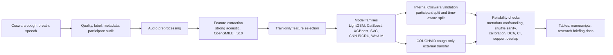

# COVID Respiratory Audio Reliability Study

[](#scope-and-limits)
[](pyproject.toml)
[](#datasets)
[](#main-result)

This repository studies a direct question:

> Do COVID respiratory-audio models remain reliable when strong internal results are tested under temporal validation, metadata-confounding checks, calibration, and external dataset transfer?

The internal Coswara result is strong, but deployment-style checks expose large reliability gaps. The repository is organized as a research artifact for validation, domain shift, and benchmark reliability.

## Main Result

The validation-selected equal-weight multimodal Coswara setting reaches `0.895` AUROC and `0.862` AUPRC. An exploratory logistic stack reaches `0.897` AUROC and `0.863` AUPRC. Under stricter checks, performance drops:

| Test | Result | Interpretation |
|---|---:|---|
| Existing participant split | `0.895` AUROC, `0.862` AUPRC | Validation-selected equal-weight cough--speech fusion |
| Time-stratified participant split | `0.849` AUROC, `0.783` AUPRC | Lower under time-aware validation |
| Early-to-late temporal split | about `0.698` AUROC | Calendar drift damages reliability |
| COUGHVID external cough transfer, classical acoustic models | `0.523-0.543` AUROC | Weak external discrimination |
| COUGHVID external cough transfer, WavLM transformer | `0.484` AUROC | Transformer representation did not rescue transfer |
| COUGHVID external cough transfer, CNN-BiGRU | `0.548` AUROC | Weak external discrimination in the deep spectrogram branch |
| Full metadata-only model | `0.964` AUROC | Metadata/context can strongly predict labels |
| Symptoms-only metadata model | `0.932` AUROC | Symptoms alone are a strong shortcut predictor |
| Early/late acoustic feature-selection overlap | `0.074` Jaccard | Selected acoustic features are non-stationary |

Source ledger: [`docs/research_briefing/COVID_RARS_RESULTS_EVIDENCE.md`](docs/research_briefing/COVID_RARS_RESULTS_EVIDENCE.md)

## Contribution

This project contributes an evidence chain, not only a classifier:

- A multimodal Coswara respiratory-audio pipeline using cough, breath, and speech.
- Acoustic, OpenSMILE, classical ML, CNN-BiGRU, WavLM, and fusion branches.
- Participant-level and time-aware validation.
- COUGHVID cough-only external transfer.
- Metadata-confounding, shuffle-label sanity, support-overlap, calibration, decision-curve, bootstrap, and feature-stability audits.
- Manuscript-ready result tables and evidence documents.

The main research claim is:

> Strong internal COVID respiratory-audio performance is achievable, but temporal validation, metadata-confounding audits, and external transfer show that high internal scores are not enough for deployment claims.

## What Was Built

The repository contains a complete research pipeline:

| Layer | What is implemented |
|---|---|
| Data preparation | Coswara indexing, metadata cleaning, participant-aware splits, quality audit, COUGHVID indexing |
| Feature extraction | MFCC/mel/spectral/acoustic summaries, OpenSMILE ComParE/IS10 routes, SSL/representation feature routes |
| Models | Classical tabular models, calibrated branches, fusion models, CNN-BiGRU spectrogram branch, WavLM branch |
| Reliability checks | Temporal holdout, early-to-late validation, external transfer, metadata confounding, shuffle sanity, bootstrap CI, calibration, decision curves, support overlap, feature stability |
| Reporting | Paper tables, experiment manifests, research briefing docs, manuscript drafts, preserved result bundles |

## Repository Map

| Path | Purpose |
|---|---|
| [`src/covid_rars/`](src/covid_rars/) | Importable implementation |
| [`scripts/`](scripts/) | Numbered command-line workflow scripts |
| [`tests/`](tests/) | Pytest suite |
| [`docs/`](docs/) | Research briefing, professor-facing notes, and repository documentation |
| [`data/`](data/) | Local/generated data tree; raw data follows source licenses |
| [`reports/`](reports/) | Generated tables, figures, manifests, and final evidence notes |
| [`results/frozen/`](results/frozen/) | Frozen experiment outputs |
| [`results/representations/`](results/representations/) | OpenSMILE, BEATs, and PANNs representation outputs |
| [`artifacts/bundles/`](artifacts/bundles/) | Preserved zip/tar.gz evidence bundles |
| [`manuscripts/`](manuscripts/) | Venue-specific manuscript drafts, PDFs, figures, and source tables |
| [`docs/repository/`](docs/repository/) | Repository map and restructure notes |
| [`archive/`](archive/) | Historical patches, review exports, and old update notes |

Detailed map: [`docs/repository/REPOSITORY_MAP.md`](docs/repository/REPOSITORY_MAP.md)

## Review Order

For a reviewer, collaborator, or manuscript writer, start here:

1. [`docs/research_briefing/COVID_RARS_E2E_PROJECT_BRIEF.md`](docs/research_briefing/COVID_RARS_E2E_PROJECT_BRIEF.md)
2. [`docs/research_briefing/COVID_RARS_RESULTS_EVIDENCE.md`](docs/research_briefing/COVID_RARS_RESULTS_EVIDENCE.md)
3. [`docs/research_briefing/COVID_RARS_PLAIN_LANGUAGE_EXPLANATION_GUIDE.md`](docs/research_briefing/COVID_RARS_PLAIN_LANGUAGE_EXPLANATION_GUIDE.md)
4. [`docs/research_briefing/COVID_RARS_RESULTS_COMPARISON.md`](docs/research_briefing/COVID_RARS_RESULTS_COMPARISON.md)
5. [`references/verified_source_registry.md`](references/verified_source_registry.md)
6. [`ARTIFACT.md`](ARTIFACT.md)

## Main Evidence Files

| Question | File to inspect |
|---|---|
| What are the final validation-ladder numbers? | [`docs/research_briefing/COVID_RARS_RESULTS_EVIDENCE.md`](docs/research_briefing/COVID_RARS_RESULTS_EVIDENCE.md) |
| What explains the complete project first? | [`docs/research_briefing/COVID_RARS_E2E_PROJECT_BRIEF.md`](docs/research_briefing/COVID_RARS_E2E_PROJECT_BRIEF.md) |
| How should results be explained in simple language? | [`docs/research_briefing/COVID_RARS_PLAIN_LANGUAGE_EXPLANATION_GUIDE.md`](docs/research_briefing/COVID_RARS_PLAIN_LANGUAGE_EXPLANATION_GUIDE.md) |
| Where are source and claim checks documented? | [`references/verified_source_registry.md`](references/verified_source_registry.md) |
| Where are frozen result folders? | [`results/frozen/`](results/frozen/) |
| Where are representation outputs? | [`results/representations/`](results/representations/) |
| Where are manuscript source tables and figures? | [`manuscripts/source_artifacts/`](manuscripts/source_artifacts/) |

## Pipeline



## Experiment Families

The numbered scripts under [`scripts/`](scripts/) document the execution order. The most important families are:

| Family | Representative scripts |
|---|---|
| Dataset preparation and validation | `00_*` through `12_validate_artifacts.py` |
| Baseline ML, calibration, fusion, and reporting | `06_train_ml_baselines.py` through `24_make_experiment_manifest.py` |
| External COUGHVID transfer | `13_build_coughvid_index.py`, `18_cross_dataset_feature_eval.py`, `19_extract_coughvid_features.py`, `25_run_external_model_grid.py` |
| Confounding and clinical reliability | `29_metadata_confounding_audit.py` through `43_make_research_closure_bundle.py` |
| Temporal validation | `44_temporal_holdout_audit.py`, `45_temporal_paper_summaries.py`, `46_temporal_month_causal_audit.py` |
| Strong acoustic and OpenSMILE/IS10 branch | `47_run_strong_baseline.py` through `58_run_compare_is10_final_validation.py` |
| Reviewer evidence additions | `59_run_final_uncertainty_calibration.py` through `68_run_incremental_audio_metadata_value.py` |

## Datasets

| Dataset | Role | Use in this artifact |
|---|---|---|
| Coswara | Primary respiratory-audio dataset | Supports internal cough, breath, and speech analysis with participant-level controls |
| COUGHVID | External cough-only dataset | Tests cough-to-cough transfer only; it does not validate full cough+breath+speech fusion |

Raw datasets are not redistributed here unless permitted by their source licenses. Follow the dataset owners' access and citation rules.

## Install

Windows PowerShell:

```powershell
cd Covid-RARS
git lfs install
git lfs pull
git submodule update --init --recursive HST
python -m venv .venv
.\.venv\Scripts\Activate.ps1
python -m pip install --upgrade pip
python -m pip install -r requirements.txt
python -m pip install -e .
```

Linux/macOS:

```bash
cd Covid-RARS
git lfs install
git lfs pull
git submodule update --init --recursive HST
python3 -m venv .venv
source .venv/bin/activate
python -m pip install --upgrade pip
python -m pip install -r requirements.txt
python -m pip install -e .
```

Optional dependency sets live at the repository root, including development, GPU, HST, and extended requirements.

## Test

The default development profile verifies the core package. Tests that execute
HST training or authenticate the official HST checkpoints are skipped when
those optional prerequisites are unavailable.

```powershell
cd Covid-RARS
python -m pip install -r requirements-dev.txt
python -m pytest
```

For the full HST verification path, use Ubuntu with the declared GPU profile,
install `requirements-hst.txt`, prepare the pinned checkpoints, and then run
the HST tests. The exact commands and hardware assumptions are documented in
[`docs/HST_UBUNTU_RUNBOOK.md`](docs/HST_UBUNTU_RUNBOOK.md).

Quick checks from the repository root:

```powershell
python -m compileall -q src scripts tests
python -m json.tool notebooks\00_RUN_EVERYTHING_PUBLICATION.ipynb > $null
```

Some full experiment scripts require raw Coswara and/or COUGHVID data plus optional dependencies. The frozen results in [`results/`](results/) preserve the completed evidence outputs already present in this repository.

## Manuscripts And Artifacts

| Area | Location |
|---|---|
| Manuscript drafts and PDFs | [`manuscripts/`](manuscripts/) |
| Shared manuscript figures | [`manuscripts/common_figures/`](manuscripts/common_figures/) |
| Source tables used by manuscripts | [`manuscripts/source_artifacts/`](manuscripts/source_artifacts/) |
| Compressed reproducibility/evidence bundles | [`artifacts/bundles/`](artifacts/bundles/) |
| Artifact review guide | [`ARTIFACT.md`](ARTIFACT.md) |

The result folders are retained as evidence. The top-level layout separates active code from frozen outputs so reviewers can find the implementation without losing traceability to completed runs.

## Reproducibility

This repository supports three levels of review:

| Level | What can be checked |
|---|---|
| Static review | Read code, docs, frozen tables, manuscripts, and source registry |
| Core unit/integration review | Install `requirements-dev.txt` and run `python -m pytest`; optional HST runtime tests skip when prerequisites are absent |
| HST implementation review | Follow `docs/HST_UBUNTU_RUNBOOK.md` with the pinned submodule, official checkpoints, HST requirements, and declared Ubuntu/GPU environment |
| Full experiment reproduction | Requires raw Coswara/COUGHVID access and optional dependencies; follow dataset-source terms |

The frozen artifacts are included to preserve completed evidence even when raw data cannot be redistributed.

## Scope And Limits

This repository supports these claims:

- Strong internal Coswara respiratory-audio performance was achieved.
- Performance drops under stricter temporal validation.
- COUGHVID cough-only external transfer has weak discrimination across classical, transformer, and deep spectrogram branches.
- Metadata/context variables are strong shortcut predictors.
- Calibration, decision-curve, bootstrap, support-overlap, and feature-stability checks are part of the evaluation.
- The evidence supports a reliability/domain-shift paper.

This repository does not establish:

- A clinical COVID diagnostic system.
- Real-world deployment readiness.
- Universal SOTA superiority across COVID-audio papers.
- COUGHVID validation of full multimodal fusion.
- Proof that no COVID acoustic marker exists.

## Citation

Use [`CITATION.cff`](CITATION.cff) as the repository citation stub. Update author and venue metadata before a public archival release if the manuscript author list changes.
