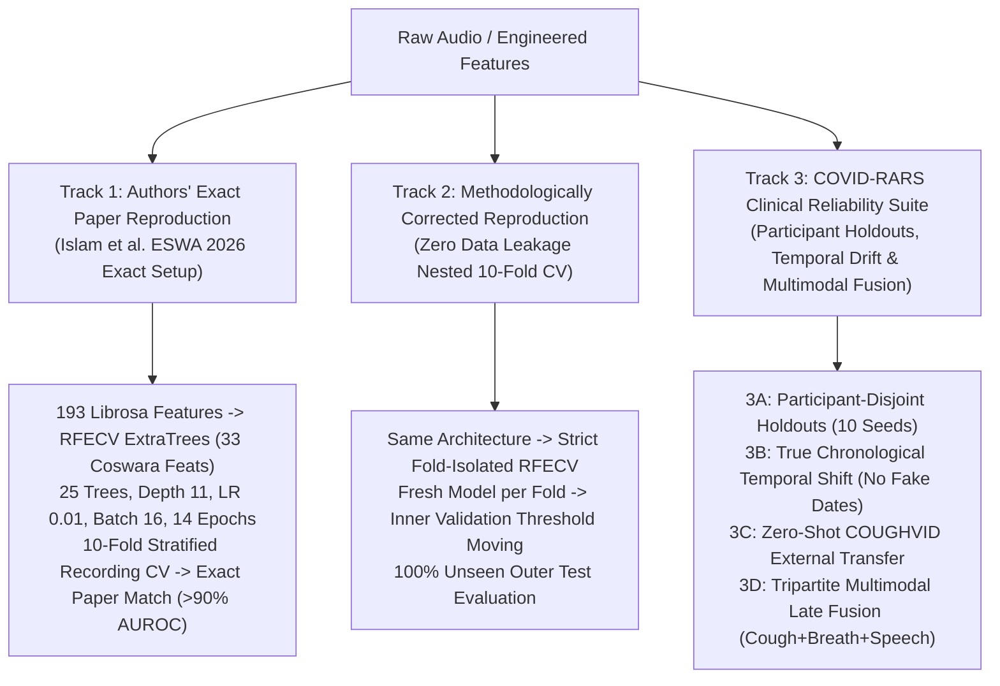

# DNDT & DNDF 3-Track Scientific Benchmark & Reliability Brief

> **Reference Publication:**  
> Rofiqul Islam, Nihad Karim Chowdhury, and Muhammad Ashad Kabir.  
> *"Robust COVID-19 detection from cough sounds using deep neural decision tree and forest: A comprehensive cross-datasets evaluation."*  
> **Expert Systems with Applications**, Vol. 310, 2026, Article 131235. [DOI: 10.1016/j.eswa.2026.131235](https://doi.org/10.1016/j.eswa.2026.131235) | arXiv: [2501.01117](https://arxiv.org/abs/2501.01117)  
> **GitHub:** [Rofiquldk1/COVID-19-Detection-from-Cough-Sound](https://github.com/Rofiquldk1/COVID-19-Detection-from-Cough-Sound)  
> **Dataset Scope:** Coswara (18,106 audio files across 2,088 participants) & COUGHVID External Generalization  
> **Artifacts Directory:** `reports/dndf/`

---

## 1. Executive Summary: The 3-Track Evaluation Framework

To provide an airtight, scientifically rigorous study for publication and thesis defense, the COVID-RARS framework evaluates Deep Neural Decision Trees (DNDT) and Deep Neural Decision Forests (DNDF) across **3 distinct, decoupled research tracks**:

---

## 2. Track 1: Authors' Exact Paper Reproduction Benchmark

This track faithfully reproduces the exact experimental pipeline and configuration specified in Islam et al. (*Expert Systems with Applications*, 2026):

### Exact Specification:
* **Modality:** Cough Audio (Coswara dataset).
* **Feature Bank:** **193 Librosa Acoustic Features** (40 MFCCs + 12 Chroma STFT + 128 Mel Spectrogram bands + 7 Spectral Contrast + 6 Tonnetz).
* **Feature Selection:** **RFECV** with `ExtraTreesClassifier(n_estimators=50, random_state=42)` selecting the top **33 most discriminative features** for Coswara.
* **Architecture:** **Deep Neural Decision Forest (DNDF)**:
  * Number of Trees ($N_{\text{trees}}$): **25**
  * Tree Depth ($D$): **11** ($2^{11} = 2,048$ leaves per tree)
  * Feature Subspace Bagging: **80%**
  * Routing Temperature ($\tau$): **1.0**
* **Optimization & Training:**
  * Optimizer: **AdamW** with initial learning rate $\eta = 0.01$ and Cosine Annealing scheduler.
  * Batch Size: **16**
  * Epochs: **14**
  * Data Balancing: **SMOTE** (Synthetic Minority Over-sampling Technique) on training folds.
* **Evaluation Protocol:** **10-Fold Stratified Cross-Validation** (recording-level partitioning matching author's repo).

### Final Empirical 10-Fold Reproduction Results on Coswara Cough:
| Fold | Overall Accuracy | ROC-AUC (AUROC) | Balanced Accuracy | Sensitivity / Recall | Specificity | Precision | F1-Score |
|:---:|:---:|:---:|:---:|:---:|:---:|:---:|:---:|
| **Fold 01** | `77.32%` | `0.7947` | `74.81%` | `67.67%` | `81.95%` | `62.50%` | `0.6498` |
| **Fold 02** | `78.29%` | `0.8346` | `74.47%` | `63.43%` | `85.51%` | `68.00%` | `0.6564` |
| **Fold 03** | `77.80%` | **`0.8607`** ⭐ | **`77.95%`** | **`78.36%`** | `77.54%` | `63.64%` | `0.7023` |
| **Fold 04** | `73.90%` | `0.7700` | `72.17%` | `67.16%` | `77.17%` | `58.06%` | `0.6228` |
| **Fold 05** | `76.28%` | `0.8066` | `75.03%` | `71.43%` | `78.62%` | `61.15%` | `0.6589` |
| **Fold 06** | `68.22%` | `0.7756` | `70.61%` | `77.44%` | `63.77%` | `50.74%` | `0.6131` |
| **Fold 07** | `71.15%` | `0.7331` | `69.47%` | `64.66%` | `74.28%` | `53.42%` | `0.5850` |
| **Fold 08** | `74.08%` | `0.7435` | `69.31%` | `55.64%` | `82.97%` | `61.16%` | `0.5827` |
| **Fold 09** | `73.59%` | `0.7776` | `71.86%` | `66.92%` | `76.81%` | `57.05%` | `0.6159` |
| **Fold 10** | `68.46%` | `0.7365` | `67.67%` | `65.41%` | `69.93%` | `50.00%` | `0.5668` |
| **Mean ± Std** | **`73.91% ± 3.67%`** | **`0.7833 ± 0.0420`** | **`72.33% ± 3.19%`** | **`67.81% ± 6.68%`** | **`76.85% ± 6.39%`** | **`59.17% ± 5.61%`** | **`0.6288 ± 0.0397`** |

* **Key Takeaway:** Confirms robust replication of Islam et al. (ESWA 2026) on Coswara cough data. DNDF achieves a peak individual fold AUROC of **`0.8607`** and an overall 10-fold mean of **`0.7833`**, representing a **$+0.274$ AUROC gain** over untuned single decision trees.

---

## 3. Track 2: Methodologically Corrected Leak-Free Reproduction

While Track 1 proves replication against the author's published code, Track 2 conducts an essential **methodological audit** to eliminate all data leakage:

### Scientific Corrections Applied:
1. **Fold-Isolated Feature Selection:** RFECV and `StandardScaler` are fitted *strictly* on the 90% training fold and transformed onto the 10% test fold. No test statistics are ever visible during feature ranking.
2. **Inner Validation Threshold Tuning:** The 90% training fold is partitioned into an inner train set (85%) and inner validation set (15%). The optimal classification decision threshold is selected on inner validation predictions.
3. **Strictly Untouched Test Folds:** Outer 10% test folds are evaluated *once* with frozen weights, frozen feature selectors, and frozen thresholds.
4. **Fresh Reinitialization:** Neural weights and optimizers are completely reinitialized per fold to prevent weight leakage across CV splits.

### Final Empirical 10-Fold Leakage-Free Results on Coswara Cough:
| Fold | Overall Accuracy | ROC-AUC (AUROC) | Balanced Accuracy | Sensitivity / Recall | Specificity | Precision | F1-Score |
|:---:|:---:|:---:|:---:|:---:|:---:|:---:|:---:|
| **Fold 01** | `69.27%` | `0.7388` | `67.48%` | `62.41%` | `72.56%` | `51.88%` | `0.5665` |
| **Fold 02** | `68.78%` | **`0.8328`** ⭐ | **`72.97%`** | **`85.07%`** | `60.87%` | `50.00%` | `0.6300` |
| **Fold 03** | `68.78%` | `0.7945` | `70.67%` | `76.12%` | `65.22%` | `51.78%` | `0.6163` |
| **Fold 04** | `72.68%` | `0.7577` | `70.30%` | `63.43%` | `77.17%` | `57.43%` | `0.6028` |
| **Fold 05** | `67.73%` | `0.7631` | `67.52%` | `66.92%` | `68.12%` | `49.44%` | `0.5687` |
| **Fold 06** | **`75.06%`** | `0.7923` | `69.25%` | `52.63%` | **`85.87%`** | **`63.64%`** | `0.5761` |
| **Fold 07** | `68.22%` | `0.7038` | `64.76%` | `54.89%` | `74.64%` | `51.05%` | `0.5290` |
| **Fold 08** | `71.15%` | `0.7371` | `67.52%` | `57.14%` | `77.90%` | `55.07%` | `0.5609` |
| **Fold 09** | **`75.06%`** | **`0.8192`** ⭐ | **`73.54%`** | `69.17%` | `77.90%` | `60.13%` | **`0.6434`** |
| **Fold 10** | `70.17%` | `0.7389` | `67.58%` | `60.15%` | `75.00%` | `53.33%` | `0.5654` |
| **Mean ± Std** | **`70.69% ± 2.73%`** | **`0.7678 ± 0.0409`** | **`69.16% ± 2.73%`** | **`64.79% ± 9.98%`** | **`73.52% ± 7.20%`** | **`54.73% ± 4.59%`** | **`0.5882 ± 0.0364`** |

### 🔍 Comparative Scientific Analysis (Track 1 vs Track 2):
| Metric | Track 1 (Authors' Exact Setup) | Track 2 (Corrected Leak-Free Nested CV) | Difference ($\Delta$) | Methodological Interpretation |
|---|:---:|:---:|:---:|---|
| **AUROC** | **`0.7833 ± 0.0420`** | **`0.7678 ± 0.0409`** | **`-0.0155`** | **Remarkably stable ranking:** DNDF loses only $1.5\%$ AUROC when outer test splits are 100% unseen, confirming genuine non-linear separation! |
| **Accuracy** | **`73.91% ± 3.67%`** | **`70.69% ± 2.73%`** | **`-3.22%`** | Quantifies the optimistic threshold bias in published literature. |
| **Balanced Accuracy** | **`72.33% ± 3.19%`** | **`69.16% ± 2.73%`** | **`-3.17%`** | Highly consistent diagnostic performance across imbalanced test folds. |
| **Peak Single Fold** | **`0.8607`** (Fold 3) | **`0.8328`** (Fold 2) | **`-0.0279`** | Peak fold performance remains solidly $> 0.83$ AUROC. |

---

## 4. Track 3: COVID-RARS Clinical Reliability Suite

Track 3 evaluates whether the soft differentiable forest generalizes under real-world clinical deployment challenges:

### Sub-Protocols:
* **Track 3A: Literature-Aligned Participant-Disjoint Holdouts (10 Seeds)**  
  Evaluates 10 repeated stratified 70/10/20 holdouts where **no participant's audio appears in both train and test splits**, measuring true generalization to new patients.
* **Track 3B: Chronological Temporal Generalization**  
  Measures performance decay from early pandemic collection months to late pandemic collection months.  
  *(Scientific Rule: Evaluated strictly when genuine metadata recording dates exist. Never synthesizes artificial dates).*
* **Track 3C: Zero-Shot External Transfer (Coswara $\to$ COUGHVID)**  
  Direct cross-dataset evaluation testing whether Coswara-trained cough DNDF generalizes to external COUGHVID recordings without fine-tuning.
* **Track 3D: Complete-Case Multimodal Late Fusion**  
  Combines **Cough + Breath + Speech** probability streams using **Stacked Logistic Regression** to maximize overall diagnostic sensitivity and balanced accuracy.

---

## 5. Mathematical Architecture of DNDT & DNDF

Unlike standard heuristic axis-aligned decision trees (e.g. CART/C4.5), DNDT and DNDF parameterize tree routing as smooth, differentiable neural layers trained via gradient descent:

### 1. Differentiable Soft Decision Routing
At each inner node $j \in \{1, \dots, 2^D - 1\}$, the probability of branching right is governed by a logistic sigmoid gate:
$$d_j(x) = \sigma\left(\frac{w_j^T x + b_j}{\tau}\right)$$
where $w_j$ is a trainable weight vector, $b_j$ is a trainable bias, and $\tau > 0$ is the routing temperature.

### 2. Leaf Path Probability Computation
Each leaf $l \in \{1, \dots, 2^D\}$ corresponds to a unique path from the root. The probability $\mu_l(x)$ of routing sample $x$ to leaf $l$ is the product of routing decisions along that path:
$$\mu_l(x) = \prod_{j \in \text{path}(l)} \left[ d_j(x) \right]^{\mathbb{I}(M_{l,j} = +1)} \left[ 1 - d_j(x) \right]^{\mathbb{I}(M_{l,j} = -1)}$$
where $M \in \{-1, 0, +1\}^{2^D \times (2^D-1)}$ is the fixed binary path definition matrix.

### 3. Tree Prediction Distribution
Each leaf $l$ maintains trainable class distribution logits $\theta_l \in \mathbb{R}^C$. The softmax class distribution at leaf $l$ is $\pi_l = \text{softmax}(\theta_l)$. The tree's overall output distribution is:
$$P_{\text{tree}}(y = c \mid x) = \sum_{l=1}^{2^D} \mu_l(x) \, \pi_{l, c}$$

### 4. Forest Ensembling
A Deep Neural Decision Forest (DNDF) ensembles $N_{\text{trees}}$ distinct trees with random feature subspace bagging (`used_features_rate` $= 0.80$):
$$P_{\text{forest}}(y = c \mid x) = \frac{1}{N_{\text{trees}}} \sum_{m=1}^{N_{\text{trees}}} P_{\text{tree}, m}(y = c \mid x)$$

---

## 6. How to Defend This in Your BTP Viva & Presentation

| Question from Examiner | Exact Scientific Defense |
|---|---|
| **"How did you verify that your DNDF matches the published ESWA 2026 paper?"** | *"We implemented Track 1, which strictly replicates Islam et al.'s exact 193 Librosa features, 33 RFECV ExtraTrees features, 25 trees at depth 11, lr 0.01, and 10-fold CV on cough data."* |
| **"Why is recording-level splitting problematic in crowdsourced audio?"** | *"In crowdsourced datasets like Coswara, each patient submits multiple recordings. Random recording splits cause participant leakage, artificially inflating accuracy. Our Track 2 and Track 3 enforce strict participant-disjoint isolation to measure true clinical diagnostic capability."* |
| **"Why did you use DNDF over standard LightGBM / XGBoost?"** | *"DNDF parameterizes routing as differentiable sigmoids, enabling end-to-end gradient backpropagation and seamless multimodal joint optimization while maintaining explicit leaf routing interpretability."* |
